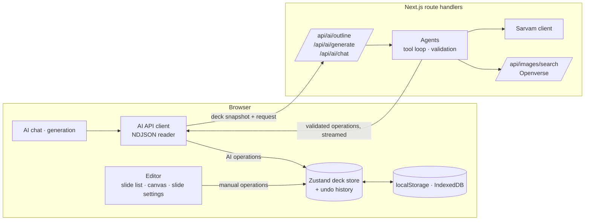

# AI Presentation Builder

Describe a presentation, review the outline the AI proposes, and watch the slides appear one by one. Then refine the deck by chatting with the AI or by editing it directly — both work on the same slide data, so neither undoes the other.

**Live app:** https://ai-ppt-builder-five.vercel.app/

## Features

### Generate a deck from a prompt

- **Two-phase generation.** Describe the deck and pick a slide count (3 to 12). The AI first returns an **outline** — a title, key points and a planned visual for each slide — which you can edit before a single slide is written: rewrite titles and points, reorder slides, and add or remove them.
- **Slide-by-slide streaming.** Approving the outline generates the slides one at a time, each streamed into the editor the moment it validates, so you watch the deck fill up instead of a spinner.
- **Progress, cancellation and retry.** The progress panel names the slide currently being written. Stopping keeps every slide generated so far, and a slide that fails can be retried on its own without regenerating the rest.
- **Visuals are planned, not guessed.** Each outline item carries the kind of visual it wants (`none`, `image`, `chart` or `table`), so the slide writer knows what to produce; image blocks are filled from stock-photo search during generation.

### Refine by chatting

- **Targeted edits.** "Make slide 3 more concise", "add a pricing slide before the conclusion", "turn slide 5 into a two-column comparison". The AI works through five tools — `add_slide`, `update_slide`, `delete_slide`, `move_slide`, `change_layout` — so it changes only the slides it names.
- **Multi-step requests.** Up to 4 model rounds and 20 applied changes per message. The deck is re-serialized between rounds, so the model sees the result of its own earlier calls and can fix a rejected one.
- **Selection-aware.** The slide you have selected is sent as context, so "this slide" means what you think it means.
- **Your edits win.** Every AI change carries the slide revision it was prepared against. If you edited that slide while the AI was working, the change is skipped instead of overwriting you — and the chat tells you which slide it skipped and why.
- **Stop and retry.** Stopping mid-turn keeps the changes already applied. Errors distinguish rate limiting, a provider outage, a request the provider rejected, an empty response and a cut-off response, and the ones worth retrying show a Retry button.
- **Chat history** is saved per deck in the browser; the last 20 messages are sent with each request.

### Edit manually

- **Slides.** Add, delete and reorder slides; switch a slide between the five layouts (`title`, `section`, `content`, `two-column`, `comparison`) with existing content redistributed rather than discarded.
- **Content blocks.** Add, replace, move and resize blocks inside and between columns, up to 4 blocks per column.
- **Click-to-edit.** Clicking text on the canvas jumps to its field in the slide settings panel, so the slide itself is the navigation.
- **Per-type editors.** Dedicated editors for tables (add/remove rows and columns, edit cells), charts (type, categories, series, values) and images (search, upload, alt text), plus speaker notes on every slide.
- **Layout controls.** Text alignment (left or centre) and the column split (25–75%) are part of the slide data, so the AI and the editor change them the same way.

### Content types

| Block | Details |
| --- | --- |
| Bullets | Up to 8 per block, 220 characters each |
| Paragraph | Up to 800 characters |
| Table | Up to 6 columns × 8 rows, with a header row |
| Chart | 12 types: bar, stacked bar, line, stacked line, area, stacked area, pie, funnel, treemap, sunburst, sankey, scatter (Recharts) |
| Image | Openverse stock-photo search or your own upload, with alt text |

Every limit is declared once in `features/deck/utils/schema.ts` and enforced identically for saved decks, manual edits and AI output — a chart with a series shorter than its category list is rejected before it can reach the renderer.

### Direct manipulation and keyboard support

- Drag blocks within a column and between columns, drag slides in the slide list to reorder, and drag the gap between columns or blocks to resize them.
- All of it works from the keyboard too: `@dnd-kit` was chosen for its keyboard sensors and screen-reader announcements, and resizing uses `react-resizable-panels`.
- **Undo/redo** with `Cmd`/`Ctrl` + `Z` (add `Shift` to redo), covering manual and AI changes alike — an AI turn undoes as one step, not twenty.
- `Escape` clears the canvas selection; controls are labelled and focus order follows the layout.

### Themes and appearance

- Four slide themes — **Paper**, **Midnight**, **Editorial** and **Sunset** — each a set of design tokens (fonts, colours, chart palette) applied by the renderer, so switching a theme never touches slide content.
- Light and dark mode for the app itself, independent of the slide theme.

### Presentations and storage

- Multiple presentations with a dashboard: create, rename inline, open and delete, each with a live thumbnail of its first slide.
- Decks and chat history are saved in `localStorage`, uploaded images in IndexedDB. Saving is automatic, and a save failure is surfaced rather than swallowed.

### Export

- **Print or save as PDF** — a dedicated print route renders every slide at 1280×720, one per page.
- **Download a slide as PNG** — the slide is re-rendered off screen at export size, so the file never depends on your window width.

## Setup

Requirements: Node.js 20.9 or later, npm, and a [Sarvam](https://www.sarvam.ai/) API key.

```bash
npm install
```

Create `.env.local` in the project root:

```bash
SARVAM_API_KEY=your-key-here
```

The key is only read on the server (`lib/env.ts`) and is never sent to the browser. `.env*` files are ignored by git. If the key is missing, the app still starts and AI requests report the problem.

```bash
npm run dev        # http://localhost:3000
```

| Command                       | What it does                      |
| ----------------------------- | --------------------------------- |
| `npm run dev`                 | Development server                |
| `npm run build` / `npm start` | Production build and server       |
| `npm test`                    | Unit and component tests (Vitest) |
| `npm run typecheck`           | TypeScript check                  |
| `npm run lint`                | ESLint                            |

### Deploying to Vercel

Import the repository in Vercel, add `SARVAM_API_KEY` under Settings → Environment Variables, and deploy. No other configuration is needed; the AI routes set their own `maxDuration` (up to 300 seconds for deck generation).

## Architecture

### The core idea

Every change to a deck — typing in the editor, dragging a block, an AI tool call — is a **`DeckOperation`** applied by one pure function, `applyOperation(deck, operation)` in `features/deck/utils/operations.ts`. Operations are validated against the same zod schema as saved decks, and operations that edit a slide carry the slide's `revision`: if the slide changed since the operation was prepared (for example you edited it while the AI was working), the operation is rejected instead of overwriting your edit.

This is what makes AI edits targeted: the model never returns a whole deck, only operations for the slides it changes.

### Data flow



The browser owns the deck. Each AI request sends a snapshot of the deck; the server keeps no state. During a chat request the server applies the model's operations to a working copy, so the model sees the result of its own earlier tool calls, and streams each operation back as it is accepted.

### AI pipeline

| Step          | Where                                                                                                                                                                                                               |
| ------------- | ------------------------------------------------------------------------------------------------------------------------------------------------------------------------------------------------------------------- |
| Input         | `features/ai/components` (chat panel, prompt and outline review), validated with zod before sending                                                                                                                 |
| Orchestration | `services/ai/agents`: `chat-agent.ts` (tool loop, up to 4 rounds), `outline-agent.ts`, `slide-generator.ts`                                                                                                         |
| Tools         | `services/ai/tools`: chat tools `add_slide`, `update_slide`, `delete_slide`, `move_slide`, `change_layout`; generation tools `create_outline`, `create_slide`. Tool parameters are JSON Schemas generated from zod. |
| Model         | `services/ai/api/sarvam-client.ts`: `sarvam-105b`, streamed, retried on network and provider errors                                                                                                                 |
| Streaming     | Upstream: Sarvam's SSE stream. Downstream: NDJSON events (`features/ai/utils/stream-protocol.ts`), read by `services/ai/api/api.ts`                                                                                 |
| Validation    | Model input schemas (`features/ai/utils/slide-input.ts`) → domain objects with ids → `applyOperation` checks                                                                                                        |
| Context       | `features/ai/utils/deck-context.ts` describes the deck in compact text: numbered slides with ids, layouts, sizes and block content                                                                                  |
| State update  | Deck store, with the same revision checks as manual edits                                                                                                                                                           |
| Rendering     | `SlideRenderer`, which knows nothing about AI                                                                                                                                                                       |

**Two-phase generation:** `/api/ai/outline` returns an outline (titles, key points and a planned visual per slide) that you can edit. `/api/ai/generate` then creates the slides one at a time, each with a forced `create_slide` tool call, and streams each slide into the deck as soon as it is valid. A failed slide can be retried on its own; stopping keeps the slides already generated.

### Folders

| Folder               | Contents                                                                                                                         |
| -------------------- | -------------------------------------------------------------------------------------------------------------------------------- |
| `app/`               | Routes: `/` (presentations), `/decks/[deckId]` (editor), `/decks/[deckId]/print`, and the API route handlers                     |
| `features/deck/`     | Slide schema (zod), types, `DeckOperation` and `applyOperation`                                                                  |
| `features/decks/`    | Presentation list, Zustand store, saving                                                                                         |
| `features/editor/`   | Editor: slide list, canvas with toolbar, drag and resize handles, slide settings, undo history                                   |
| `features/renderer/` | Pure, read-only `SlideRenderer`, shared by the canvas, thumbnails, print view and PNG export                                     |
| `features/ai/`       | Chat and generation UI, stream protocol, model input schemas, deck context                                                       |
| `features/export/`   | Print view and PNG export                                                                                                        |
| `features/themes/`   | Slide themes (design tokens) and theme picker                                                                                    |
| `services/`          | External systems: Sarvam and agents (`ai/`), Openverse image search (`images/`), browser storage (`localStorage/`, `indexedDb/`) |
| `design-system/`     | Shared UI components and charts (Recharts)                                                                                       |
| `lib/`               | Server environment, request parsing                                                                                              |
| `testing/`           | Test setup, fixtures, MSW handlers                                                                                               |

### The slide schema

A deck has slides; a slide has a layout (`title`, `section`, `content`, `two-column`, `comparison`), a title and subtitle, 0–2 columns of content blocks, speaker notes and layout hints (alignment, column split). Blocks are bullets, paragraph, table, chart or image, and each may have a height share. Limits (slides per deck, blocks per column, text lengths, chart shapes) live in `features/deck/utils/schema.ts` and apply equally to saved data, manual edits and AI output.

## Key decisions

- **Sarvam `sarvam-105b`** with OpenAI-style tool calling. Generation forces its tool with reasoning off, which was faster and more reliable than letting the model decide.
- **Export is print-to-PDF and PNG, not PPTX.** The print view renders every slide at 1280×720, one per page, and the browser's "Save as PDF" makes the file. This covers the brief's export requirement without a PPTX library.
- **Client-owned data, stateless server.** Decks and chat history are saved in `localStorage`, uploaded images in IndexedDB. There is no backend database or authentication, as allowed by the brief.
- **One renderer for everything.** Editing controls (toolbar, drop targets, resize handles) are layers over the renderer, so the canvas, thumbnails, print view and PNG export always match.
- **Layout-based editing, not free-form positioning.** Blocks live in columns; moving and resizing change their order, the column split and height shares. This keeps AI edits and manual edits on the same simple structure.
- **Drag and drop and resizing** use `@dnd-kit/core` / `@dnd-kit/sortable` and `react-resizable-panels`, chosen for keyboard support and screen reader announcements.
- **Generation is sequential**, one slide per model call, so each slide can be streamed and retried individually and a deck of up to 12 slides fits in Vercel's 300-second limit.

A longer write-up of the design is in [`docs/ImplementationPlan.md`](docs/ImplementationPlan.md).

## Known issues and limitations

- **Everything is saved in one browser.** Presentations live in `localStorage` and uploaded images in IndexedDB; they don't sync between browsers or devices. Clearing site data removes them.
- **No PPTX export** (see Key decisions).
- **Long chats:** only the last 20 messages are sent to the model, with the current deck. Older messages aren't summarized, so the AI can lose track of requests made much earlier in a long conversation.
- **Print page size** is set to 1280×720 with CSS `@page`. It was tested in Chrome; browsers that ignore it print on their own paper size, with slides scaled to the page width.
- **Undo history** is kept only while the presentation is open and is cleared on reload.
- **AI speed:** each model call takes several seconds, so a 12-slide deck takes a while to generate. Charts use illustrative numbers unless your prompt includes data; the speaker notes say so.
- **Canvas toolbar:** when a block has no free space around it, the floating toolbar covers the part of the slide with the least content.
- **Test coverage:** logic, API routes and editor flows are covered by Vitest tests. Drag and drop and resizing depend on real layout, which jsdom doesn't have, so they were verified in a browser rather than in unit tests.

## Tests

```bash
npm test
```

Vitest with React Testing Library. MSW mocks the app's AI routes and Sarvam (including a recorded Sarvam stream), and any unmocked network request fails the test run, so tests never call the real Sarvam or Openverse APIs.
