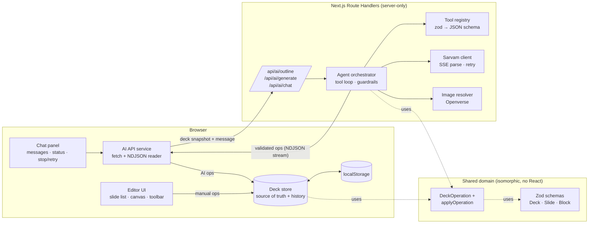
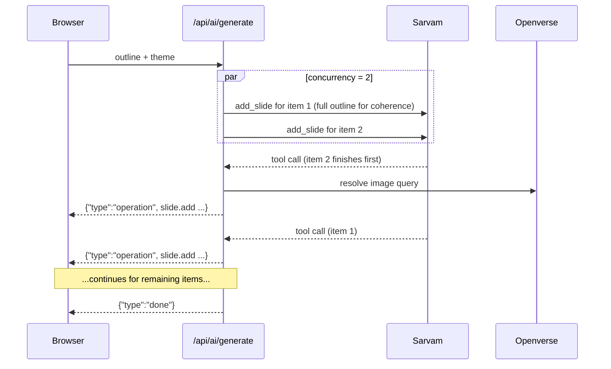

# AI Presentation Builder — Implementation Plan & Architecture

Status: approved · Date: 2026-09-13 · LLM: Sarvam `sarvam-105b`

---

## Final scope decisions (take precedence over the sections below)

- **Central design:** `DeckOperation → applyOperation → Deck` for every meaningful deck change.
- **Keep it practical:** no factories, repositories, adapters, managers, providers, wrapper components or one-function-per-file utilities.
- **P0:** multi-deck support · theme system · Deck/Slide/Block schema · DeckOperation system · editor · AI chat/refinement · Sarvam tool calling · streaming · localStorage persistence.
- **P1:** outline → review → slide generation · tables · charts · images · print/PDF · tests · deployment · README.
- **P2 (only once P0 + P1 are stable):** undo/redo · PPTX export · advanced context compaction · auth · collaboration · backend persistence.
- **Multi-deck:** create, switch, rename, delete; all decks persisted in localStorage; deck management kept separate from slide editing.
- **Themes:** 3–4 predefined, typed, data-driven themes (`features/deck/themes.ts` is the single source of tokens); `themeId` stored on each deck; no theme builder.
- **Generation:** sequential per-slide generation first; concurrency only if clearly worth it.
- **AI statuses:** never show raw model reasoning; show "Generating…", "Updating slides…", "Adding image…", "Applying changes…", "Done".
- **Editor:** `SlideRenderer` stays pure/read-only; editing controls wrap it.
- **Stack:** Next.js App Router, React, strict TypeScript, Zod, Zustand, Vitest, React Testing Library, MSW, npm. Other dependencies (drag-and-drop, charts) are decided in the phase that needs them.
- **Delivery:** in phases, each stopping for approval. Phase 1 = domain foundation (schemas, themes, operations, materialization, AI context serialization, tests).

---

## 0. Verified facts (spikes run before planning)

These were checked against the real services, not assumed from docs.

| Area | Finding | Design consequence |
|---|---|---|
| Sarvam tool calling | One request ("make slide 1 concise + add a pricing slide before the conclusion") returned **2 parallel tool calls** with correct arguments, `finish_reason: "tool_calls"`, ~8s | Agent loop with OpenAI-style `tools` is viable |
| Sarvam reasoning | Reasoning is on by default; a trivial edit used **~600–1000 completion tokens** of reasoning, `content` was empty | Budget `max_tokens` for reasoning; keep each call's output small |
| Sarvam streaming + tools | Streams `delta.reasoning_content` first, then OpenAI-style `delta.tool_calls` fragments (`index`, `id`+`name` on first chunk, `arguments` string fragments), then `finish_reason`, then `data: [DONE]` | Server can emit each slide as soon as its tool call completes |
| Sarvam limits | 128K context; max output 4096 tokens (Starter); 40 req/min on `sarvam-105b`; `stream_options`/`max_completion_tokens` unsupported | One slide per generation call; retry with backoff on 429/503 |
| Images | Openverse `GET /v1/images/?q=` works **without a key**; returns `url`, `thumbnail`, `license`, `creator`, `attribution` | Model supplies an image *query*, server resolves it to a real URL |
| Hosting | Vercel Hobby: 300s max function duration (includes streamed response), 4.5MB body limit | Generation must finish < 300s; set `maxDuration` |
| Next 16 | Route Handlers use Web `Request`/`Response`; POST handlers never cached; `maxDuration` route segment config exists | Streaming route handlers, no caching config needed |

---

## 1. Scope & priorities

**P0 — core loop (must work end-to-end first)**
- Slide schema + validation
- Deck operations (the diff model) shared by manual edits and AI edits
- Editor: render, edit text, add, delete, reorder
- Chat refinement via Sarvam tool calls with targeted patches
- Streaming updates to the UI
- localStorage persistence

**P1 — remaining must-haves**
- Two-phase generation (outline → slides), slides appearing one by one
- Rich content: tables, charts, images
- Export: clean print-to-PDF view
- Deployed on Vercel + README

**P2 — nice-to-haves (in cut order: last listed is cut first)**
1. Unified undo/redo (AI + manual)
2. Context window management (compact deck serialization + rolling chat summary)
3. Themes
4. PPTX export
5. Multi-deck dashboard

---

## 2. Architecture overview

### Core principle

> **Everything that changes a deck is a `DeckOperation`, applied by one pure function.**
> Manual edits, AI tool calls, undo/redo and tests all go through `applyOperation(deck, op)`.

This is what makes diff-based editing, coexistence of manual + AI edits, and unified history possible. The AI never returns "a deck"; it returns operations.

### System diagram



### Pipeline separation (per `.claude/rules/ai-presentation.md`)

| Step | Where |
|---|---|
| 1. User input | `ChatPanel`, `PromptForm`, `OutlineReview` (validated with zod before send) |
| 2. Orchestration | `features/ai/services/agent.ts`, `generate-slides.ts` (server) |
| 3. Streaming / response handling | `sarvam-client.ts` (upstream SSE) · `ai-api.ts` (downstream NDJSON) |
| 4. Parsing | `tool-call-accumulator.ts` (assemble argument fragments → JSON) |
| 5. Validation | zod tool-input schemas → `materializeSlide` → `applyOperation` checks |
| 6. State update | deck store `apply()` with revision/conflict checks |
| 7. Rendering | `SlideRenderer` (pure, knows nothing about AI) |

### Why the server is stateless

The client owns the deck (localStorage is allowed by the brief). Each AI request sends a **deck snapshot**. The server keeps a *working copy* during the request so the model sees the results of its own earlier tool calls in multi-round loops, and streams the resulting operations back. No database, no session storage, nothing to sync.

---

## 3. Slide schema

Internal types (inferred from zod schemas in `features/deck/schema.ts`):

```ts
type SlideLayout = "title" | "section" | "content" | "two-column" | "comparison";

type Deck = {
  id: string;
  title: string;
  themeId: ThemeId;
  slides: Slide[];
  updatedAt: string;
};

type Slide = {
  id: string;            // generated by our code, never by the model
  revision: number;      // incremented on every applied change; used for conflict detection
  layout: SlideLayout;
  title: string;
  subtitle: string | null;
  columns: Column[];     // title/section: 0 · content: 1 · two-column/comparison: 2
  notes: string;         // speaker notes
  hints: LayoutHints;
};

type Column = {
  id: string;
  heading: string | null;  // used by "comparison" (e.g. "Before" / "After")
  blocks: Block[];
};

type LayoutHints = {
  align: "left" | "center";
  columnRatio: "1:1" | "2:1" | "1:2";
};

type Block =
  | { id: string; type: "bullets"; items: { id: string; text: string; level: 0 | 1 }[] }
  | { id: string; type: "paragraph"; text: string }
  | { id: string; type: "table"; header: string[]; rows: string[][] }
  | { id: string; type: "chart"; chartType: "bar" | "line" | "pie"; title: string | null;
      categories: string[]; series: { name: string; values: number[] }[] }
  | { id: string; type: "image"; query: string; alt: string; image: ResolvedImage | null };

type ResolvedImage = { src: string; width: number; height: number; attribution: string; sourceUrl: string };
```

### Why this shape

- **Uniform `columns` array instead of a per-layout union.** Every slide has the same fields, so `update_slide` patches, the editor, and layout changes don't need layout-specific code paths. Layout-specific rules (column count) are enforced by validation.
- **Stable ids on slides, columns, blocks and bullet items.** Needed for React keys, targeted edits, and conflict detection.
- **Plain text only, no HTML/markdown in content.** Nothing to sanitize; React escapes everything.
- **Images are queries, not URLs.** The model can't hallucinate or inject URLs; the server resolves the query via Openverse and records attribution.

### Validation rules (beyond types)

| Rule | Example limit |
|---|---|
| Column count matches layout | `content` → exactly 1 |
| Text lengths | title ≤ 120, bullet ≤ 220, paragraph ≤ 800, notes ≤ 2000 chars |
| Collection sizes | ≤ 8 bullets, ≤ 4 blocks per column, table ≤ 6 cols × 8 rows |
| Table integrity | every row length === header length |
| Chart integrity | 1–12 categories, 1–4 series, every `values.length === categories.length`, all numbers finite, pie → exactly 1 series with non-negative values |
| Deck size | ≤ 30 slides |

### Model-facing input schemas

The model never sees or supplies `id`, `revision`, or `image`. Separate zod schemas (`SlideInput`, `BlockInput`) describe what the model may send; `materializeSlide(input)` assigns ids and defaults. Tool parameter JSON Schemas are **generated from these zod schemas** (`z.toJSONSchema`, Zod 4 — verify at install) so there is one source of truth.

---

## 4. Deck operations (the diff model)

```ts
type DeckOperation =
  | { type: "slide.add"; slide: Slide; afterSlideId: string | null }        // null = first
  | { type: "slide.update"; slideId: string; baseRevision: number; patch: SlidePatch }
  | { type: "slide.delete"; slideId: string; baseRevision: number }
  | { type: "slide.move"; slideId: string; afterSlideId: string | null }
  | { type: "slide.changeLayout"; slideId: string; baseRevision: number; layout: SlideLayout; columns: Column[] }
  | { type: "deck.rename"; title: string }
  | { type: "deck.setTheme"; themeId: ThemeId };

type SlidePatch = Partial<Pick<Slide, "title" | "subtitle" | "columns" | "notes" | "hints">>;

function applyOperation(deck: Deck, op: DeckOperation): OperationResult;
// OperationResult = { ok: true; deck: Deck } | { ok: false; reason: "not_found" | "conflict" | "invalid" }
```

- **Pure and immutable** — untouched slides keep object identity (cheap snapshots, minimal re-renders).
- **Anchors, not indexes** (`afterSlideId`) — a concurrent manual reorder can't make an AI insert land in the wrong spot. Missing anchor → append at end.
- **Targeted by construction** — `slide.update` only replaces the fields in `patch` on one slide. There is no "replace deck" operation available to the AI.

### Manual edits vs AI edits (conflict policy)

1. The AI request snapshot contains each slide's `revision`.
2. AI `update`/`delete`/`changeLayout` operations carry that as `baseRevision`.
3. Client applies an AI op only if the slide's current `revision === baseRevision`.
4. If the user edited that slide meanwhile, the op is **skipped, not merged**, and the chat shows: *"Skipped the change to slide 3 because you edited it while I was working. Retry?"*

Deterministic, never silently overwrites a user edit, easy to explain and test.

---

## 5. AI tools

| Tool | Parameters (model-facing) | Server behaviour |
|---|---|---|
| `add_slide` | `afterSlideId: string \| null`, `slide: SlideInput` | materialize ids → resolve images → `slide.add` |
| `update_slide` | `slideId`, any of `title`, `subtitle`, `columns`, `notes`, `hints` | validate → `slide.update` with snapshot revision |
| `delete_slide` | `slideId` | `slide.delete` |
| `reorder_slides` | `slideIds: string[]` (full new order) | validate it's a permutation → convert to minimal `slide.move` ops |
| `change_layout` | `slideId`, `layout`, optional `columns` | if `columns` omitted, deterministic conversion (split/merge columns) |
| `create_outline` | `deckTitle`, `slides: OutlineItem[]` | phase 1 only |

**Tool results are fed back to the model.** Success → short summary (`"Updated slide 3 (s_ab12)"`). Validation failure → the zod error message, so the model can correct itself in the next round. This is the "agentic" part: the model chooses tools, sees results, and can fix mistakes.

**Deck context given to the model** (compact, token-efficient): numbered slides with ids, layout, title, and a text summary of blocks. Users say "slide 3"; the model must answer with an id, so both are shown: `3. [s_ab12] content — "Pricing" — bullets: ...`.

---

## 6. Two-phase generation

> Assumption: "two-phase generation" (mentioned in the brief's must-haves but not defined) means **outline first, then slides**. This matches how Gamma works and directly addresses Sarvam's 4096-token output cap.

### Phase 1 — Outline (`POST /api/ai/outline`)

- Input: `{ prompt, slideCount? }`
- Model is asked to call `create_outline` → `{ deckTitle, slides: [{ title, layout, keyPoints[], visual: "none" | "image" | "chart" | "table" }] }`
- UI shows an **editable outline**: rename, reorder, remove, add items, then "Generate slides".
- Cheap (one call), and lets the user fix structure before spending tokens on content.

### Phase 2 — Slides (`POST /api/ai/generate`, streaming)



- **One Sarvam call per slide, sequential** (per final scope decisions; concurrency only if clearly beneficial), each given the full outline so slides stay coherent and don't repeat each other.
- Slides are placed by outline position; the UI shows placeholders ("Generating slide 4 of 8…") that fill in as slides arrive.
- **Per-slide failure isolation:** invalid output → one retry with the validation error → still invalid → `slide_failed` event with a Retry button for just that slide. Valid slides are kept.
- Estimated time: 8 slides × ~8–15s ÷ 2 ≈ 40–60s, well under Vercel's 300s.

**Why not one call for the whole deck:** it would exceed the 4096 output cap (reasoning included), give no per-slide progress, and one malformed slide would fail everything.

---

## 7. Chat refinement (agent loop)

`POST /api/ai/chat` — body: `{ deck, messages (recent window), summary?, selectedSlideId? }`

```
for round in 1..MAX_ROUNDS (4):
  stream Sarvam completion with tools, tool_choice "auto"
  while streaming:
    reasoning deltas  → emit status "Thinking…" (throttled; raw reasoning not shown)
    tool-call deltas  → accumulate by index
    call complete     → parse JSON → zod validate → applyOperation(workingDeck)
                        → emit {"type":"operation"} → record tool result
  if finish_reason == "tool_calls": append assistant msg + tool results, continue
  else: emit {"type":"message", text}, break
emit {"type":"done"}
```

**Guardrails:** `MAX_ROUNDS = 4`, max 20 operations per turn, `max_tokens` sized for reasoning + output, request body validated with zod (deck ≤ 30 slides, message ≤ 4000 chars), upstream 429/503 retried with exponential backoff (max 2 retries).

**Cancellation:** Stop button → `AbortController` → `request.signal` is passed to the upstream Sarvam `fetch`, so the model call is actually cancelled. Operations already applied stay (each is atomic and valid) and are reported as "Stopped after updating slides 2 and 3".

**Interrupted connection:** stream ends without `done` → chat shows "Connection lost. Changes received so far were kept." with Retry.

---

## 8. Stream protocol (server → browser)

Transport: **NDJSON over `fetch`** (`Content-Type: application/x-ndjson`), one JSON event per line.
Chosen over SSE/`EventSource` because requests are POST with a deck body (EventSource is GET-only), and one self-contained line per event is trivial to parse and test.

```ts
type AiStreamEvent =
  | { type: "status"; phase: "thinking" | "applying" | "resolving_images"; message: string }
  | { type: "outline"; outline: Outline }
  | { type: "slide_progress"; outlineIndex: number; status: "generating" | "done" | "failed"; error?: string }
  | { type: "operation"; operation: DeckOperation }
  | { type: "message"; text: string }
  | { type: "warning"; message: string }            // e.g. an invalid tool call was dropped
  | { type: "error"; code: AiErrorCode; message: string; retryable: boolean }
  | { type: "done" };
```

The client validates every event with zod too — the network is also an untrusted boundary.

---

## 9. Client state

Three kinds of state, kept separate (per rules):

| State | Lives in | Persisted |
|---|---|---|
| **Deck** (slides, theme, title) + history | `features/editor/store/deck-store.ts` | localStorage (debounced, validated on load) |
| **AI session** (chat messages, request status, generation progress, abort controller) | `features/ai/store/ai-session-store.ts` | chat messages only |
| **Editor UI** (selected slide, focused field, open menus) | component state | no |

**Store library: Zustand.** Needed so typing in one slide doesn't re-render every slide and the chat panel (selector-based subscriptions). A Context + `useReducer` would re-render all consumers on every keystroke.

**Loading persisted data:** parsed with the same zod schema; invalid/corrupt data → start with an empty deck and show a notice (never crash).

**Undo/redo (P2):** history of deck snapshots per transaction (cheap thanks to structural sharing). A transaction is one manual action (text typing coalesced per field focus) or one AI turn's operations. Keyboard: ⌘Z / ⇧⌘Z.

---

## 10. UI

```
┌───────────────────────────────────────────────────────────────────────────┐
│ Deck title          [Theme ▾]  [↶ ↷]                     [Export / Print] │
├────────────┬───────────────────────────────────────┬──────────────────────┤
│ Slide list │  Slide canvas (16:9, editable)        │  Chat                │
│  1 ▢       │                                       │  messages            │
│  2 ▢  ⋮    │   Title                               │  "Updated slide 3"   │
│  3 ▢       │   • bullet                            │  status: Thinking…   │
│  + Add     │   • bullet                            │  [Stop]              │
│            │   Speaker notes ▾                     │  [ message input ]   │
└────────────┴───────────────────────────────────────┴──────────────────────┘
```

- **Empty state:** prompt box with example prompts and slide count → outline review → generation progress.
- **Slide list:** drag to reorder + keyboard alternative (Move up/down in a menu), add, delete (with undo toast; destructive action is explicit).
- **Canvas:** inline editing via auto-sizing textareas styled as slide text (no rich-text editor; content is plain text by design). Tables editable cell by cell; charts edited via a small data grid.
- **`SlideRenderer`** is one pure component used by the canvas (editable), thumbnails (scaled, read-only), and print view.
- **Charts:** Recharts (SVG output prints cleanly).
- **Images:** plain `` with attribution caption. `next/image` isn't used because Openverse images come from arbitrary hosts that can't be listed in `remotePatterns`.
- **Accessibility:** labelled controls, keyboard reorder, visible focus, status text (not color alone), `aria-live` region for generation progress.

---

## 11. Folder structure

```
app/
  layout.tsx
  page.tsx                          thin: renders <Workspace />
  print/page.tsx                    print-to-PDF view
  api/ai/outline/route.ts
  api/ai/generate/route.ts          export const maxDuration = 300
  api/ai/chat/route.ts

Follows `.claude/rules/architecture.md`: `features/<feature>/{components,hooks,services,utils}/` + `types.ts`.
Folders are only created when a phase needs them. The tree below shows the target shape.

features/
  deck/                             domain — no React, Zustand, Next.js or browser-only APIs
    types.ts                        Deck, Slide, Block, Column, DeckOperation, OperationResult
    utils/
      schema.ts                     all zod validation, incl. the operation schema
      operations.ts                 applyOperation (+ layout redistribution)
      create.ts                     createDeck, createBlankSlide, createColumn, createId

  themes/
    types.ts                        Theme, ThemeId
    utils/themes.ts                 theme tokens (single source of truth)
    components/                     ThemeSelector (Phase 2)

  decks/                            deck management (kept separate from slide editing)
    components/                     DeckList, CreateDeckButton, RenameDeckDialog
    hooks/                          useDecksStore (Zustand: all decks + active deck id)
    services/deck-storage.ts        localStorage read/write + validation

  editor/
    components/                     Workspace, SlideList, SlideCanvas, SlideRenderer (pure),
                                    blocks/{Bullets,Paragraph,Table,Chart,Image}, Toolbar
    hooks/                          useDeckActions (dispatch DeckOperations)

  ai/
    types.ts                        SlideInput, SlidePatchInput, AiStreamEvent
    utils/
      slide-input.ts                model-facing schemas + materialize*   (Phase 1)
      deck-context.ts               serializeDeckForModel                  (Phase 1)
      tool-call-accumulator.ts      streamed tool-call fragments → complete calls
      stream-protocol.ts            AiStreamEvent schema + NDJSON line parsing
    services/
      sarvam-client.ts              server-only: fetch, SSE parsing, backoff, abort
      tools.ts                      server-only: tool definitions generated from zod
      agent.ts                      server-only: chat tool loop + prompts
      generate-slides.ts            server-only: outline + sequential per-slide generation
      images.ts                     server-only: Openverse resolver
      ai-api.ts                     browser: POST + NDJSON stream reader
    hooks/                          useChat, useGeneration
    components/                     ChatPanel, PromptForm, OutlineReview, GenerationProgress

  export/
    components/PrintDeck.tsx
    print.css

components/ui/                      only genuinely shared primitives (Button, IconButton, …)
lib/env.ts                          server env validation (SARVAM_API_KEY)
test/                               vitest setup, MSW server + handlers, recorded Sarvam fixtures
```

Tests live next to the code they test (`*.test.ts(x)`).

---

## 12. Validation & error handling

| Boundary | Validated with | On failure |
|---|---|---|
| Request body → route handler | zod | 400 with message; UI shows error |
| Sarvam HTTP errors | status code | 429/503 → backoff retry; 401 → "API key invalid" (logged server-side, generic to user); other → `error` event, retryable |
| Tool-call arguments | `JSON.parse` + zod | error fed back to model as tool result (self-correction); dropped after retry → `warning` event |
| Unknown tool name / unknown slide id | tool registry / `applyOperation` | error fed back to model |
| Empty response (no tools, no text) | agent loop | `error` event "The AI returned nothing, try rephrasing", retryable |
| Truncated (`finish_reason: "length"`) | agent loop | partial tool call discarded (never applied), `warning` |
| Stream events → browser | zod | event ignored + logged; stream without `done` → interrupted state |
| AI op vs. edited slide | `baseRevision` | op skipped, user notified, retry offered |
| Persisted localStorage | zod | fresh deck + notice |
| Rendering a block | schema guarantees + per-block error boundary | "This block couldn't be displayed" instead of crashing the slide |

---

## 13. Security & cost control

- `SARVAM_API_KEY` read only in `lib/env.ts`, imported only by `server-only` modules; never `NEXT_PUBLIC_`.
- No HTML/markdown rendering of AI content; no execution of AI output.
- Image URLs come only from Openverse API responses (https), never from the model.
- Cost caps for the public deployment: slide count ≤ 12 per generation, deck ≤ 30 slides, `MAX_ROUNDS`, `max_tokens` per call, message length limit.

---

## 14. Testing strategy

Stack: Vitest, React Testing Library, user-event, MSW, jsdom. `test()` not `it()`.

| Area | Tests |
|---|---|
| Schema | valid decks; malformed AI outputs (missing fields, wrong column count, ragged tables, chart length mismatch, NaN, oversized text) |
| `applyOperation` | each op; anchors; not-found; revision conflict; untouched slides keep identity |
| `convert-layout` | content ↔ two-column ↔ comparison round trips |
| SSE parsing + tool-call accumulator | chunks split mid-line and mid-JSON; multiple parallel calls; `[DONE]`; truncated stream |
| Agent loop (MSW mocking Sarvam, using the recorded real stream format) | tool calls → ops; invalid args → error fed back → corrected; max rounds; abort |
| NDJSON client | partial lines across chunks; missing `done` → interrupted |
| Editor (RTL) | edit title/bullet; add, delete, reorder (keyboard); persistence reload |
| Chat flow (RTL + MSW) | message → streamed ops appear on slides; stop; error + retry; conflict skip notice |
| Generation flow | outline review → slides appear progressively; one failed slide shows retry, others kept |

---

## 15. Milestones (2-day budget)

### Day 1 — core loop, deployed

| # | Milestone | Done when | Est. |
|---|---|---|---|
| M0 | Setup: deps, Vitest + MSW, `lib/env.ts`, remove template page | `npm test` and `npm run lint` pass | 0.5h |
| M1 | Domain: schema, operations, materialize, convert-layout + tests | domain tests green | 2h |
| M2 | Editor with a seeded deck: renderer, text editing, add/delete/reorder, persistence | usable without AI | 3h |
| M3 | Sarvam client, accumulator, tools, chat agent loop, NDJSON protocol, ChatPanel | "make slide 2 more concise" updates only slide 2 live | 3h |
| — | Deploy to Vercel | public URL works | 0.5h |

### Day 2 — must-haves, then polish

| # | Milestone | Done when | Est. |
|---|---|---|---|
| M4 | Two-phase generation: outline + review UI + parallel slide stream + progress/stop/retry | prompt → outline → slides appear one by one | 3h |
| M5 | Rich content: table, chart, image (Openverse) blocks — render, edit, AI tools | AI can add a comparison table and a bar chart | 2h |
| M6 | Print-to-PDF view | clean one-slide-per-page PDF from browser print | 1h |
| M7 | P2 in order: undo/redo → context management → themes | as time allows | 2–3h |
| M8 | README (setup, architecture, decisions, known issues), final deploy, transcripts | deliverables complete | 1h |

**If behind schedule:** cut P2 items from the bottom of the list, never P0/P1. Document what was cut in the README.

---

## 16. Dependencies to add

| Package | Why | Alternative considered |
|---|---|---|
| `zod` (v4) | schemas, validation, tool JSON Schema generation | hand-written validators — duplicated logic |
| `zustand` | selector-based store to avoid re-rendering every slide on keystroke | Context + useReducer — re-renders all consumers |
| `@dnd-kit/core`, `@dnd-kit/sortable` | accessible drag-and-drop reorder (keyboard support built in) | native HTML5 DnD — poor keyboard/a11y |
| `recharts` | bar/line/pie charts as SVG | hand-rolled SVG — axes/labels/legend take real time |
| `server-only` | build-time guard against importing server modules in client code | convention only |
| dev: `vitest`, `@vitejs/plugin-react`, `jsdom`, `@testing-library/react`, `@testing-library/user-event`, `@testing-library/jest-dom`, `msw` | testing stack from `.claude/rules/testing.md` | — |

No Sarvam SDK: the HTTP API is small, and a thin typed client keeps the tool loop fully visible and explainable. React 19 compatibility of each package is checked at install time.

---

## 17. Risks

| Risk | Mitigation |
|---|---|
| Model ignores schema / produces invalid args | zod validation + error fed back + one retry + graceful skip |
| Reasoning consumes the output budget | size `max_tokens` per call; test `reasoning_effort: "low"` vs default in M3 |
| Forcing a specific tool via `tool_choice` unverified on Sarvam | verify in M3; fallback: `auto` + prompt + validation (reject non-matching calls) |
| ~8–15s latency per call | streaming status, per-slide progress, concurrency 2 in generation |
| Public URL drains API credit | request caps (§13) |
| Openverse image relevance varies | user can change the image query or remove the image; missing image never breaks a slide |
| Vercel 300s limit | per-slide calls with concurrency; cap slide count |

---

## 18. Open decisions (need confirmation)

1. **Two-phase = outline review step, then slide generation.** (Assumption, §6.)
2. **Dependencies in §16.** Especially Zustand, dnd-kit, Recharts.
3. **Single deck for P0/P1**, multi-deck dashboard only if time allows.
4. **Export = print-to-PDF** for P1; PPTX only as P2.
